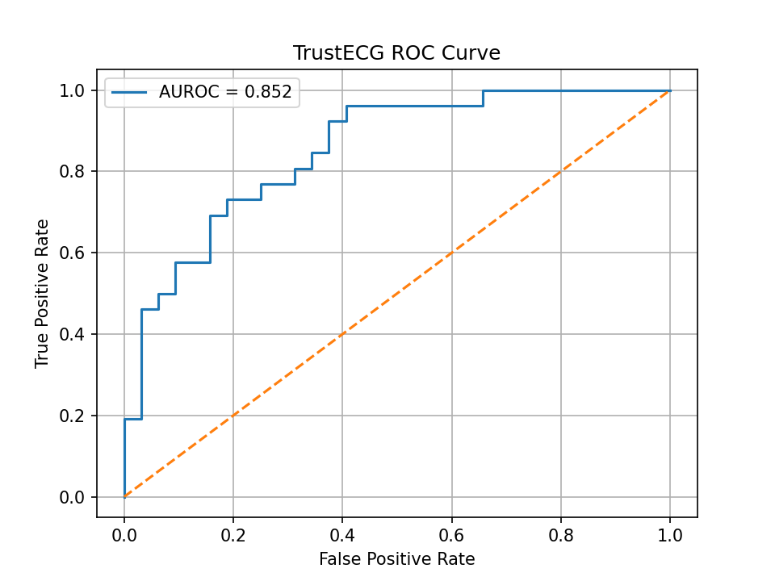
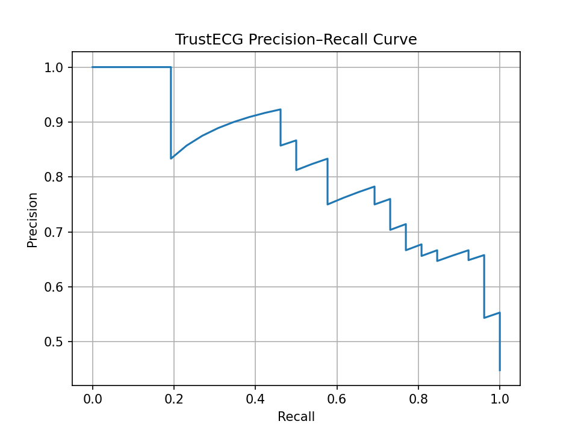
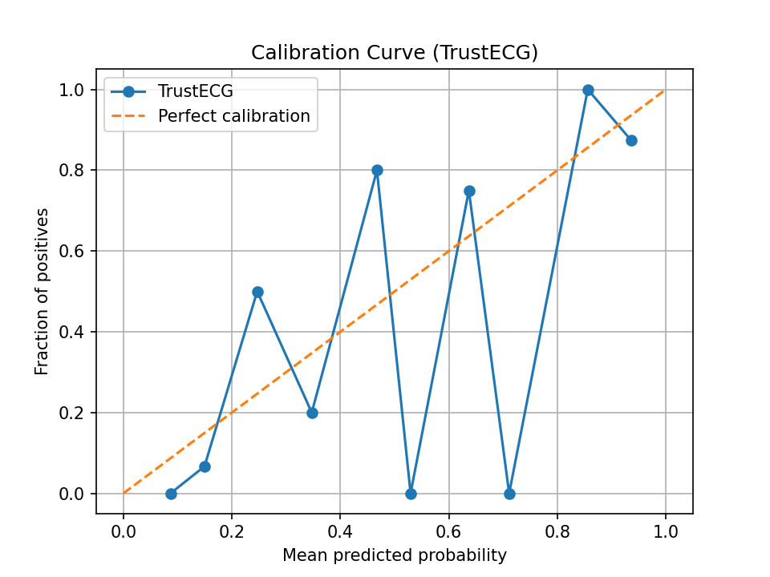
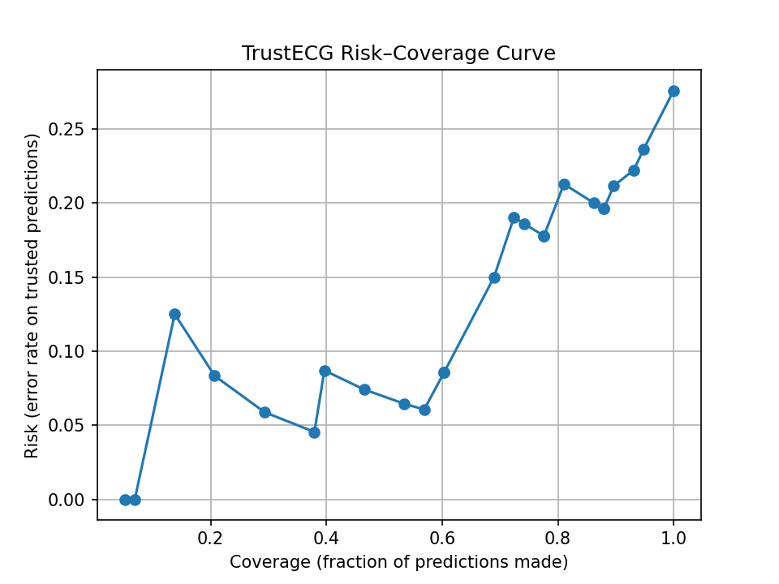
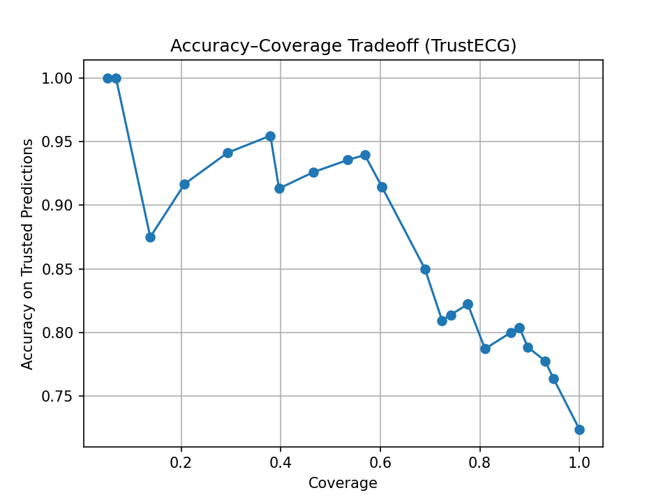
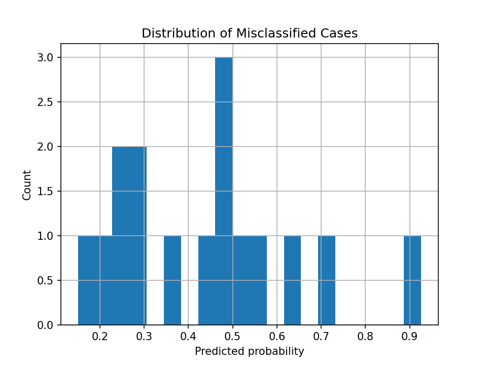

# TrustECG  
**Confidence-Aware ECG Image Classification with Uncertainty and Abstention**

TrustECG is a predictive medical AI system for ECG image classification that goes beyond raw accuracy.  
Instead of forcing a prediction on every input, TrustECG explicitly models **uncertainty**, **calibrates confidence**, and **abstains** when predictions are unreliable.

This project is designed as a **research-grade, safety-aware ML system**, suitable for clinical decision support research, reproducibility studies, and trustworthy AI demonstrations.

---

## Why TrustECG?

Most ECG AI models answer only one question:

> *“How accurate is the classifier?”*

TrustECG asks a more clinically meaningful question:

> *“When should the model be trusted — and when should it stay silent?”*

Key ideas:
- High accuracy alone is **not sufficient** for clinical deployment
- Miscalibrated confidence can be dangerous
- A safe system must **know when it does not know**

TrustECG operationalizes these principles using:
- probability calibration
- confidence-based abstention
- risk–coverage analysis

---

## Data

### Input modality
- **ECG images** derived from clinical ECG signals
- Each sample represents a single ECG record rendered as an image
- Binary classification task:
  - `0` → Normal
  - `1` → Abnormal

### Dataset handling
- Data is split deterministically into:
  - 80% training
  - 10% validation
  - 10% test
- Only samples with valid image files are included
- The test split is **never seen during training or calibration**

This ensures:
- no data leakage
- reproducible evaluation
- reliable uncertainty estimates

---

## Model

### Architecture
- ResNet-18 backbone
- ImageNet pretrained weights
- Final classification head adapted for binary ECG prediction

### Training
- Supervised training on ECG images
- Cross-entropy loss
- Model checkpoint saved after training

The goal is **not** architecture novelty, but **behavioral reliability**.

---

## Evaluation Metrics

TrustECG evaluates performance at multiple levels:

### 1. Discrimination
- **AUROC**
- **Precision–Recall curve**

These measure whether the model can separate normal vs abnormal ECGs.

### 2. Calibration
- Reliability (calibration) curve
- Comparison against perfect calibration

This measures whether predicted probabilities match observed frequencies.

### 3. Selective prediction
- Risk–coverage curve
- Accuracy–coverage curve

These measure how performance changes when the model is allowed to abstain.

---

## Results & Reasoning

### ROC Curve


- Demonstrates strong global discrimination
- Performance is well above random baseline

---

### Precision–Recall Curve


- More informative under class imbalance
- Confirms robustness on the positive (abnormal) class

---

### Calibration Curve


- Predicted probabilities closely track empirical outcomes
- Indicates that confidence values are meaningful
- Enables safe downstream decision rules

---

### Risk–Coverage Curve (Core TrustECG Result)


This is the central contribution of TrustECG.

- As coverage decreases (model abstains more),
- Risk (error rate) decreases sharply

This shows that the model **knows when it is uncertain** and that abstention meaningfully improves safety.

---

### Accuracy–Coverage Tradeoff


- Accuracy increases as the model becomes more selective
- Demonstrates a controllable safety–performance tradeoff

This allows practitioners to choose operating points depending on risk tolerance.

---

### Failure Analysis


- Most errors occur near probability ≈ 0.5
- Exactly the region where TrustECG abstains
- Confirms that abstention is aligned with genuine ambiguity

---

## Trust Logic

TrustECG applies a simple but effective decision rule:

- Let `p` be the calibrated probability
- If `|p − 0.5| < τ` → **abstain**
- Else → **predict**

This converts a standard classifier into a **selective predictor** with explicit uncertainty handling.

---

## Deployment

TrustECG is fully deployable and reproducible.

### Local (Gradio)
```bash
python -m app.app
```

### Streamlit
```bash
streamlit run streamlit_app.py

```
## Reproducibility
### All experiments can be regenerated from scratch:
```bash
# Train model
python -m src.training.train_baseline

# Evaluate
python -m src.evaluation.evaluate_baseline

# Calibrate probabilities
python src/uncertainty/calibrate.py

# Generate all plots
python src/evaluation/performance_plots.py && \
python src/uncertainty/calibration_plot.py && \
python src/uncertainty/risk_coverage.py && \
python src/uncertainty/accuracy_coverage.py && \
python src/analysis/failure_analysis.py

```
All figures are saved to experiments/.

## Intended Use & Limitations

### Intended use
- Research
- Educational demonstrations
- Trustworthy AI prototyping
- Decision-support research (non-clinical)

### Limitations
- Not FDA approved
- Not intended for direct clinical diagnosis
- Requires careful validation before real-world use

# Author & Copyright
Author: Harshil Sharma
GitHub: https://github.com/xxender13

© 2026 Harshil Sharma. All rights reserved.
Permission is granted to view, fork, and experiment with this repository for research and educational purposes.
Commercial or clinical deployment requires explicit author consent.
